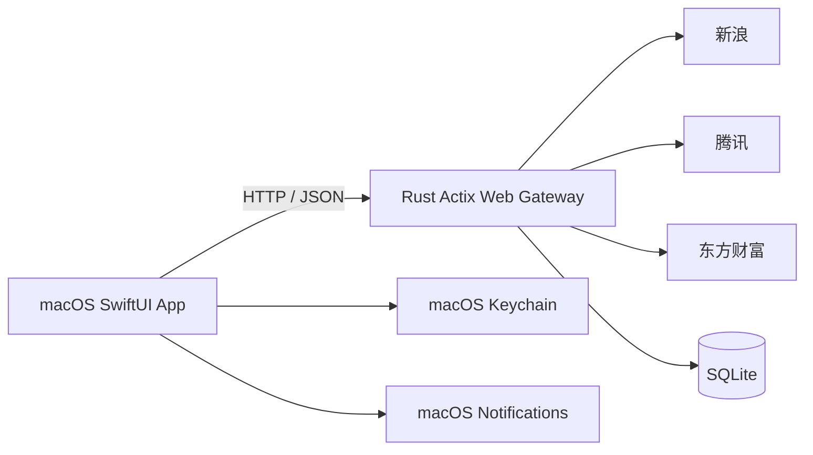

# 摸金小王子 · Mojin Prince

[](https://www.apple.com/macos/)
[](https://www.swift.org/)
[](https://www.rust-lang.org/)
[](LICENSE)

一个原生 macOS 菜单栏行情与复盘工具。SwiftUI 前端负责交互和图表，Rust 行情网关负责多数据源切换、缓存与持久化。

> 本项目用于技术研究和个人信息整理，不构成投资建议。行情可能延迟或错误；委托功能只生成草稿文本，不连接券商、不自动下单。

## 功能

- 实时报价、分时、前复权日 K，以及 MACD / KDJ / RSI 指标
- 自选股、分组、大盘指数和弱网诊断
- 支撑 / 阻力 / 成本线与两级系统通知
- 持仓浮盈浮亏展示和一键复制摘要
- OpenAI 兼容接口的 AI 分析，API Token 保存到 macOS Keychain
- 组合策略、历史回测、信号时间线和复盘日记
- 日报 / 周报：由 Rust 网关按日 / ISO 周幂等生成，复盘页一键生成与历史查看
- 半自动委托草稿：生成可复制文本，不执行交易
- Rust 网关：三源 failover、熔断、WebSocket 推送、AI 网关与数据同步 API、SQLite WAL、OpenAPI

## 架构



网关不可用时，前端暂时保留原有直连作为迁移期回退。完整设计见 [Rust 后端架构](docs/架构-Rust后端.md)。

## 环境要求

- macOS 14 或更高版本
- Xcode Command Line Tools
- Rust stable 工具链（运行网关时需要）

```bash
xcode-select --install
rustup toolchain install stable
```

## 快速开始

### 1. 克隆

```bash
git clone git@github.com:helloAInative/mojin-demo-mac.git
cd mojin-demo-mac
```

### 2. 启动本机行情网关

开发模式：

```bash
cd mojinprince-server
./scripts/dev-up.sh
./scripts/smoke.sh
```

登录后自动启动：

```bash
./scripts/install-local-service.sh
```

默认地址为 `http://127.0.0.1:8732`。Swagger UI 位于 `http://127.0.0.1:8732/swagger-ui/`。

### 3. 构建 macOS App

```bash
cd ..
BUILD_ONLY=1 ./build.sh
open "build/摸金小王子.app"
```

直接运行 `./build.sh` 会同时复制到桌面和 `/Applications`，可能需要本机写入权限。

### 4. 配置

打开 App 的「设置 → 行情」：

- 开启“优先使用 Rust 网关”
- 地址保持 `http://127.0.0.1:8732`
- 点击“测试连接”

AI 功能默认关闭。在「设置 → AI」填写兼容 OpenAI Chat Completions 的 Base URL、模型和 Token 后开启。

## 开发与测试

```bash
# Rust：格式、单元与 mock 集成测试
cd mojinprince-server
cargo fmt --check
cargo test --offline

# Rust：端到端冒烟与压测
./scripts/verify.sh

# Swift：完整打包
cd ..
BUILD_ONLY=1 ./build.sh
```

更多约定见 [CONTRIBUTING.md](CONTRIBUTING.md)。

## 目录

```text
Sources/                  SwiftUI App
Resources/                App 图标等资源
Tools/                    构建辅助工具
mojinprince-server/       Rust 行情网关
docs/                     架构与路线图
build.sh                  macOS App 构建脚本
```

## 当前状态

- 阶段 1：行情网关与 Swift 接入已完成，本机服务支持登录自启
- 阶段 2：AI 网关与 Swift 接入已完成
- 阶段 3：信号 / 持仓 / 自选 / 设置 API 与 Swift 双向同步已完成；断网保留 UserDefaults / 本地 JSON 缓存
- 阶段 4：WebSocket 行情推送、自选股交易时段调度、收盘复盘 / 周报生成（按需 API + 收盘 / 周末自动触发，按 `(kind, period_key)` 幂等）与 Swift 端复盘历史 / 手动生成（`ReportClient`）已完成；新闻 / 研报 / 板块数据接入（`/api/v1/news|reports|sector/{code}` + 每日收盘后增量刷新）已完成，研报评级自动出「机构看多 / 看空」信号并同步到 Swift；盯盘页已接入「资讯 · 研报 · 板块」面板；收盘复盘生成后有通知提醒（点击跳复盘页）
- 智能止损 / 止盈（ROI #2）：ATR + 结构 / 成本 / 阻力三锚点建议（盈亏比门槛把关），一键应用 + 委托草稿 + 跌破止损 / 触达止盈专属提醒；日报自动做「已成交卖出 vs 止损止盈价」执行对照
- 命中率时序曲线（ROI #5）：AI 命中回测从累计三件套升级为近 30 天时序图（7 日滚动命中率 + 每日信号数柱，悬停明细）

路线图见 [未来演进方向](docs/未来演进方向.md) 和 [ROI 排序](docs/按ROI排序.md)。

## 安全与隐私

- AI Token 使用 macOS Keychain 保存，不应写进源码或提交到 Git
- SQLite、日志和本机构建产物已被 `.gitignore` 排除
- 当前 Rust 服务没有实现鉴权，只应监听本机回环地址或运行在受信任网络
- 发现安全问题请按 [SECURITY.md](SECURITY.md) 的方式报告

## 参与贡献

欢迎提交 Issue 和 Pull Request。开始前请阅读 [CONTRIBUTING.md](CONTRIBUTING.md) 与 [CODE_OF_CONDUCT.md](CODE_OF_CONDUCT.md)。

## 许可证

[MIT](LICENSE)
